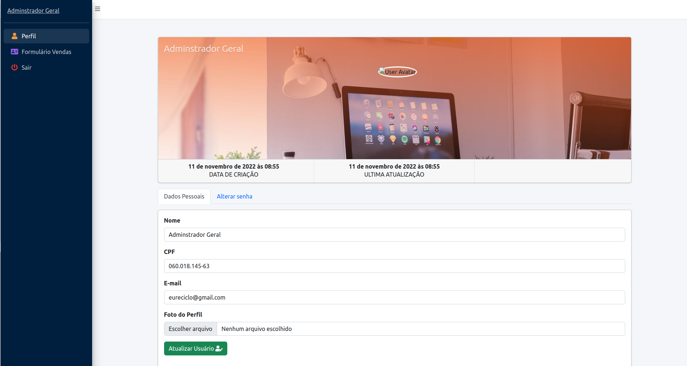
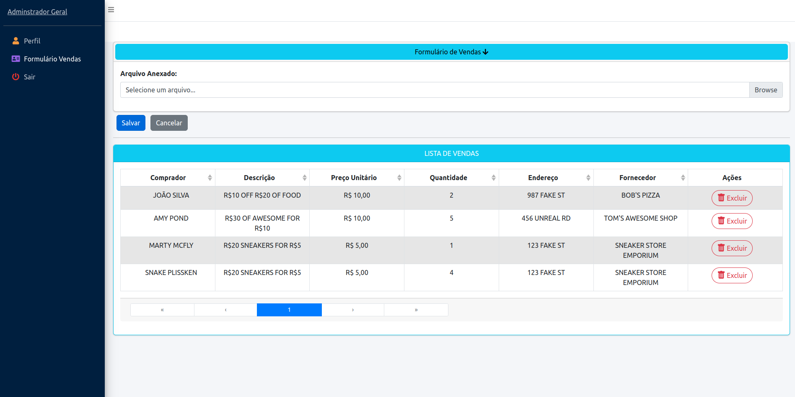

## Requisitos
- Docker
- Docker-compose
- Preferência SO linux

## Observações

- Fazer  o clone do projeto ou download em zip
- Acessar a pasta do projeto
- Verificar que nenhuma outra aplicação esta usando as porta 3306 e 8000

## Instação
- Copiar o .env.dist e renomear para .env
- docker-compose build app
- docker-compose up -d

## Rodar os seguintes comandos - Passo 1
- docker-compose exec app composer install 
- docker-compose exec app php artisan key:generate
- docker-compose exec app npm install
- docker-compose exec app npm run production

## Passo 2
- docker-compose exec app bash ou através do makefile commando make php

Ira abrir o terminal dentro do terminar, rode o comando
./scripts/migrateAndSedder

Caso tenha algum problema para executar o arquivo bash.
altere o arquivo dessa forma: chmod +x scripts/migrateAndSeeder

Caso algum problema persista, rode os commandos que estão dentro da pasta individualmente

- docker-compose exec app php artisan migrate:fresh
- docker-compose exec app php artisan db:seed
- docker-compose exec app php artisan permission:create-role superAdmin api
- docker-compose exec app php artisan passport:install --force

## rodar testes

- make tests ou docker exec -ti travellist-app ./vendor/bin/phpunit tests

## Acessar aplicação

- Acessar: http://localhost:8000/login
- email => eureciclo@gmail.com,
- senha => eureciclo,

## Menus

- Profile: http://localhost:8000/profile
- Vendas =>  http://localhost:8000/formulario-vendas

